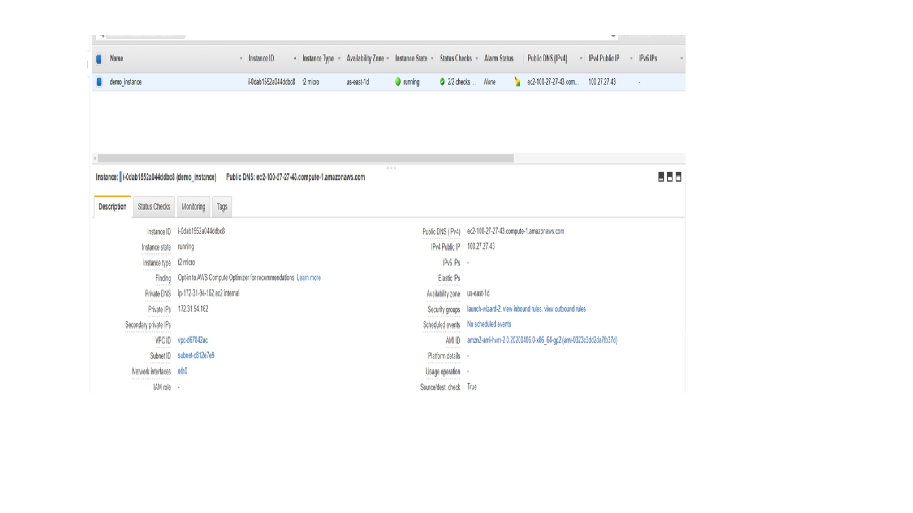

# AWS-LAB-ELB

### Purpose
- Used to demonstrate sample cloudformation templates for multiple instances sitting behind asg and elb

### Requirements
- aws account
- aws console access

### Implementation (Stages) & Removal
- Enter aws console for cloudformation and enter `network_stack.yaml` and parameters
- Once above is complete, enter `asg_lc.yaml` and required parameteres

### Test
- To test successful deployment of aws cloud resources head to EC2 section of console
- Copy `public_ip4` into console and out basic message...you can refresh page to should automatic distribution of traffic to different servers by comparing instance id

